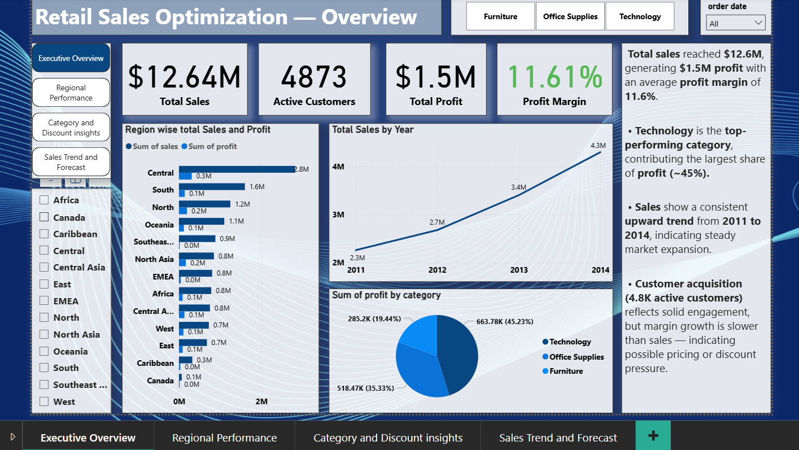

# Retail-Sales-Insights-Performance-Analysis
nalyzed 50K+ retail transactions using SQL, Python, and Power BI to uncover sales trends, profit drivers, and discount impacts.

## 🎯 Objective
To analyze retail sales data and identify key trends in sales, profit, and discount performance across regions and product categories.  
The goal was to uncover insights that could improve pricing strategy and regional profitability.

## 🧹 Data Cleaning & Preparation
- Cleaned and standardized **50K+ transaction records** using **SQL** (handled null values, duplicates, and data type mismatches).  
- Used **Python (Pandas)** for outlier detection and to format date/time columns for time-series analysis.  
- Ensured consistency across regional and category-level sales data before visualization.

## 🔍 Exploratory Data Analysis (EDA)
- Performed EDA to study **sales, profit, and discount patterns** across years and regions.  
- Analyzed **correlation between discount and profit**, identifying categories with negative profit margins.  
- Observed **seasonal sales trends**, helping highlight peak and low-performing months.

## 📊 Power BI Dashboard & Insights
- Built a **4-page interactive Power BI dashboard** displaying KPIs like total sales, profit, and profit margin by region and category.  
- Added filters for **year, region, category, and segment** for dynamic exploration.  
- Identified that **high-discount categories lowered profit margins**, while **the West region** achieved the highest year-over-year growth.

## 🗂️ Project Structure
Retail-Sales-Insights-Performance-Analysis/
│
├── SQL/
│ └── retail_data_cleaning.sql
├── Python/
│ └── eda_retail.ipynb
├── PowerBI/
│ └── retail_dashboard.pbix

## 💡 Key Insights
- High discount rates negatively impacted profit margins in furniture and office supplies categories.  
- The West region contributed the most to total profit growth (↑18% YoY).  
- Seasonal spikes observed during Q4 indicate strong year-end sales momentum.

## 🧰 Tools & Technologies
**SQL, Python (Pandas, Matplotlib, Seaborn), Power BI, DAX**

## 🖼️ Dashboard Preview

## 🚀 Future Improvements
- Add predictive modeling for sales forecasting.  
- Automate data refresh using Power BI service and scheduled SQL queries.

